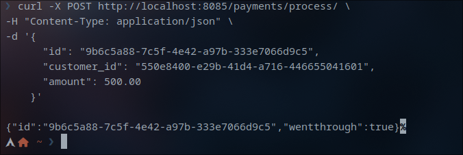

# payment

## Bun

I went with bun for this project becasue it provides a superior runtime environment to node making javascript web server on par with languages such as rust and go. [read more](https://www.priver.dev/blog/benchmark/go-vs-rust-vs-bun-vs-node-http-benchmark/)

## Code layout and structure

**index.js:** The main file of the app
**db.js:** Connection to PostgreSQL
**init.sql** Initiating the databases for containerization purposes

**cartesbancaires(directory):** Everything that has to do with bank cards (CRUD)
**payments(directory):** Everything that has to do with payments operations
**orders(directory):** Reception of the oreder and processing the payment
**bank(directory):** Sending the order to the bank and receiving whether the payment went through or not

## SQL Tables
consullt **init.sql** file for more

### cartesbancaires
contains 3 fields:
* iduser of type UUID
* codecarte of type numeric(8, 0)
* codesecret of type numeric(4, 0)

### payments
contains 6 fields:
* **id** the id of the order of type UUID
* **customer_id** the id of the customer of type UUID
* **card_code** the code of the card of type numeric(8, 0) by default randomly generated
* **card_number** same as card_code always
* **wentThrough** result of the payment of type boolean, false by default
* **amount** the amount of the payment of type double precision

## API end points

### These APIs' routes are preceded with `/payment/cartesbancaires`

**GET**
`/` returns all the records from the cartesbancaires table.
`/:iduser` returns the row for the specified *iduser*

**POST**
`/` adds a new row to the cartesbancaires table.

**DELETE**
`/:iduser` deletes the specified iduser.

`/:iduser` modifies card number and card secret of the specified iduser.

### These APIs' routes are preceded with `/payments`

**GET**
`/` returns the order Id, amount, card code & card number of all orders
`/explicit` returns all the records of the table payments
`/:id` returns the order Id, amount, card code & card number of the specified id
`/explicit/:id` returns the row for the specified id
`/result/:id` returns the order id and whether the payment went through of the specified id

**POST**
`/process/` treats the payment of an order id sent in the payload 
`/` adds a payment to the payments table

**PUT**
`/:id` changes the payment result to true (called implicitly by the **/process** post API)

## Testings

P.S. I will be adding testing images for all APIs in the assets folder.

